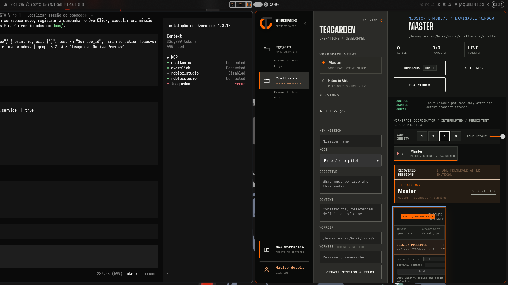
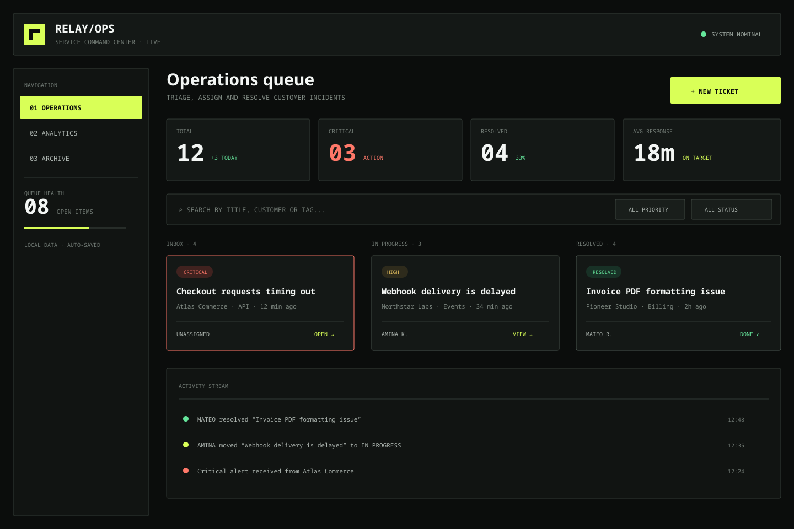
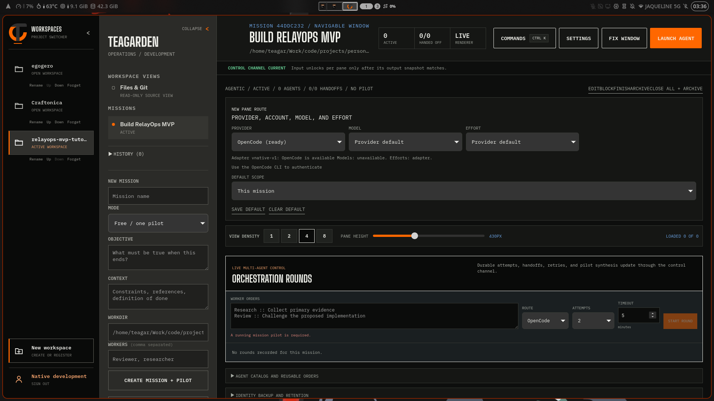
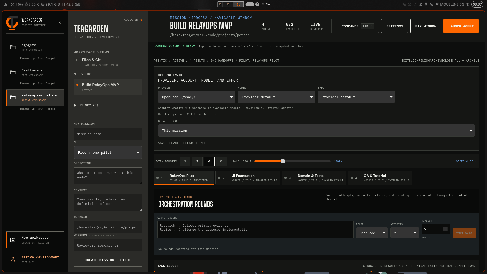
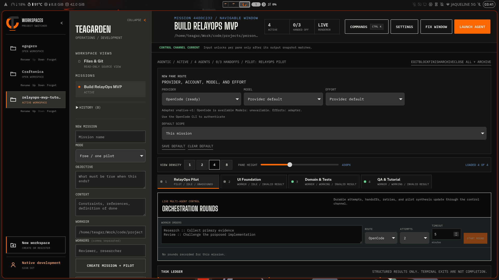
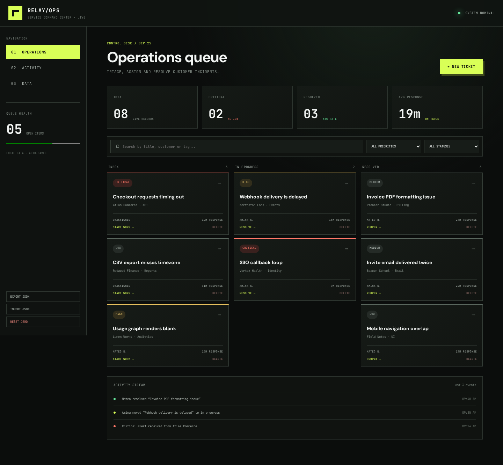
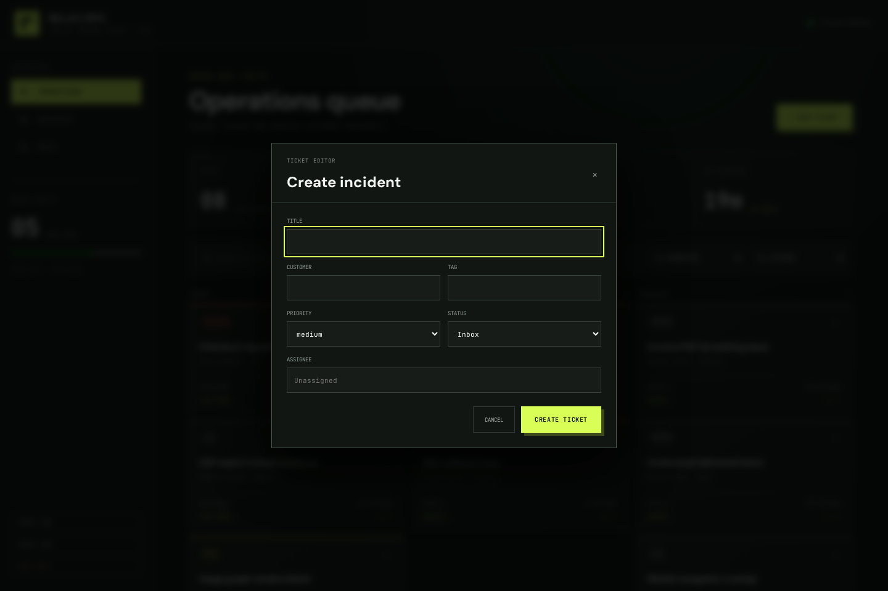
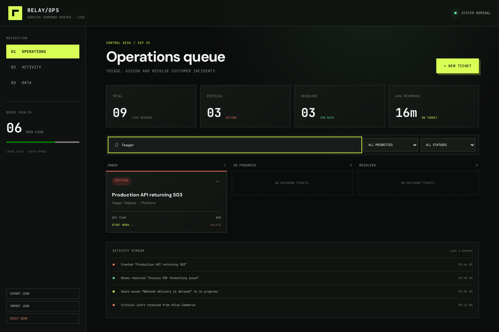
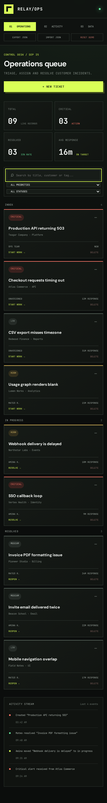
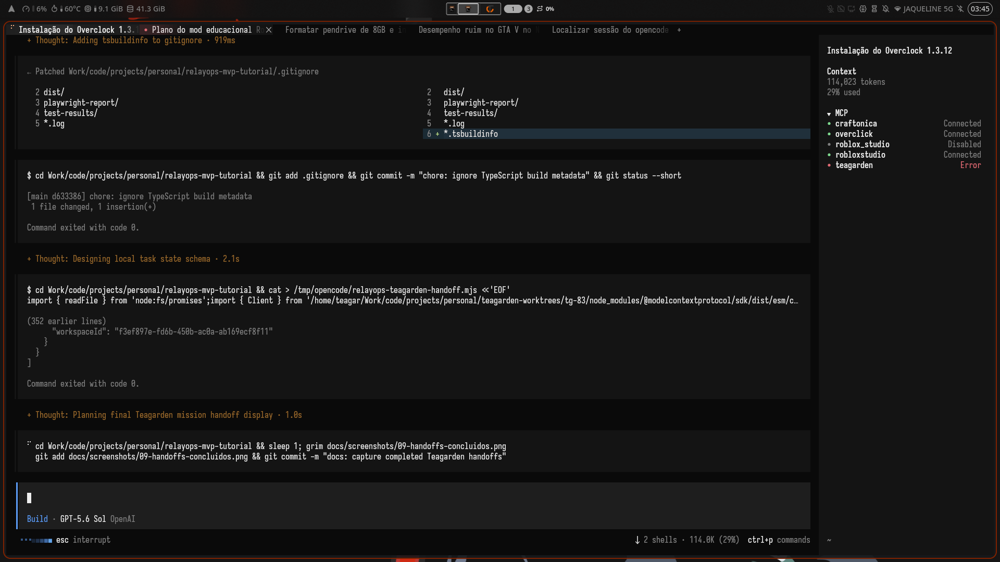

# Tutorial completo: construindo o RelayOps com Teagarden, OverClick e OpenCode

Este tutorial registra uma execução real, não uma sequência hipotética. O objetivo foi transformar o design aprovado em [`design/reference.svg`](./design/reference.svg) em um MVP funcional e testado, mantendo rastreabilidade desde o planejamento até o handoff.

## Resultado

- **Produto:** central de operações para tickets de suporte.
- **Stack:** React, TypeScript, Vite, Vitest e Playwright.
- **Persistência:** `localStorage`, sem backend.
- **Funcionalidades:** CRUD, busca, filtros, workflow, métricas, atividade, importação, exportação e reset.
- **Orquestração:** missão agentic, quatro panes, três tasks e handoffs no Teagarden; card de equipe `ROM-1` no OverClick; implementação na sessão OpenCode.

---

## 1. Maximizar o Teagarden antes de começar

Primeiro, localizei a janela nativa pelo compositor Niri, dei foco e usei `maximize-column`. A janela ficou com `1904 × 1030`, evitando que o tutorial começasse em uma área parcial.

```bash
window_id="$(niri msg windows | awk '...')"
niri msg action focus-window --id "$window_id"
niri msg action maximize-column
```



**Por que isso importa:** o Teagarden organiza sidebar, missão e múltiplos terminais. Capturas consistentes reduzem ambiguidade ao explicar o fluxo.

## 2. Fixar um design antes de implementar

Criei o wireframe vetorial antes do React. O SVG determina paleta, tipografia, hierarquia, três colunas operacionais, métricas, filtros e activity stream. Isso impede que a implementação “invente” a interface durante o desenvolvimento.



Arquivos produzidos:

- `design/reference.svg`: contrato visual.
- `PRODUCT.md`: escopo e itens explicitamente fora do MVP.
- commit `1017732`: baseline imutável de produto/design.

## 3. Criar projeto, missão e card no OverClick

No OverClick, registrei:

- projeto **RelayOps MVP Tutorial** (`ROM`);
- missão **Construir e documentar RelayOps MVP**;
- card pai **ROM-1**, prioridade alta e modo team;
- subtasks `ROM-1.1` fundação visual, `ROM-1.2` domínio e `ROM-1.3` QA/tutorial;
- critérios verificáveis para design, funções, testes e documentação.

Depois executei `task_claim` e `mission_attempt_start` com a sessão OpenCode atual. Isso evita trabalho “órfão”: o card conhece executor, modelo, esforço e sessão responsáveis.

## 4. Registrar workspace e missão no Teagarden pelo MCP

Habilitei o conector MCP no host de desenvolvimento e usei o bridge stdio privado. Nenhum bearer token ou porta efêmera foi copiado para configuração.

Sequência de ferramentas:

1. `register_workspace` para o caminho canônico do repositório;
2. `create_mission` em modo `agentic`;
3. IDs exatos retornados pelo servidor, nunca nomes visuais:
   - workspace `f3ef897e-fd6b-450b-ac0a-ab169ecf8f11`;
   - missão `44ddc232-286b-40d4-b990-e28cc21d81c5`.



## 5. Criar uma onda de panes e briefs duráveis

Usei `spawn_panes` de forma atômica para criar:

| Pane | Papel | Responsabilidade |
| --- | --- | --- |
| RelayOps Pilot | pilot | coordenar escopo, integração e aceite |
| UI Foundation | worker | traduzir SVG em layout/tokens responsivos |
| Domain & Tests | worker | domínio, persistência e testes |
| QA & Tutorial | worker | build, browser proof e evidências |

Em seguida, `set_pilot_pane` definiu o piloto e três chamadas `create_task` persistiram objetivo, contexto e critérios de aceite ligados a panes exatos.



**Capacidades do Teagarden utilizadas aqui:** workspace, missão agentic, wave atômica, piloto, roster, panes nativos, briefs imutáveis e ownership de task.

## 6. Implementar a fundação visual

A implementação traduziu o SVG em tokens CSS reutilizáveis:

- `--signal`, `--good`, `--danger`, superfícies e bordas;
- tipografia editorial (`DM Sans`) e operacional (`JetBrains Mono`);
- sidebar fixa em desktop e navegação compacta no mobile;
- métricas, filtros, kanban e activity stream;
- estados de foco visíveis, skip link e `prefers-reduced-motion`.

O layout não é uma imagem: todos os elementos são HTML semântico e responsivo.

## 7. Construir o domínio local-first

`src/domain.ts` concentra regras puras e testáveis:

- criação normalizada de tickets;
- movimentação imutável entre estados;
- métricas derivadas da lista real;
- busca textual combinada com facets;
- parser estrito para importação JSON versionada;
- seed determinístico para demonstração.

`src/App.tsx` adiciona a camada interativa: criação, edição, remoção confirmada, transição, exportação por download, importação por arquivo e reset confirmado. O `localStorage` é atualizado automaticamente.

## 8. Usar os panes para evidenciar execução paralela

Com `write_pane`, o piloto enviou comandos exatos a cada terminal:

- UI Foundation registrou a conclusão da tradução visual;
- Domain & Tests executou `npm test`;
- QA & Tutorial executou `npm run build`;
- o piloto conferiu `git status` e marcou o checkpoint `ROM-1`.



Isso demonstra uma diferença importante: o Teagarden não é apenas um launcher de terminais; ele relaciona processo, pane, agente, tarefa e resultado na mesma missão.

## 9. Validar o produto no desktop

Após `npm run check`, iniciei o Vite e executei uma prova Playwright real. A primeira captura confirma o dashboard completo em `1440 × 960`.



Resultados automatizados:

```text
Vitest: 4/4 testes
TypeScript: aprovado
Vite production build: aprovado
Browser console errors: 0
```

## 10. Provar o CRUD, não apenas a renderização

O Playwright abriu o diálogo de criação usando o nome acessível do botão.



A prova preencheu:

- título `Production API returning 503`;
- cliente `Teagar Company`;
- tag `Platform`;
- prioridade `critical`;
- responsável `Ops Team`.

Depois criou o ticket, pesquisou por `Teagar`, recarregou a página e repetiu a busca. O registro continuou presente no DOM e no `localStorage`, comprovando criação, filtro e persistência.



## 11. Provar responsividade

A mesma jornada mudou o viewport para `390 × 844`. A sidebar virou navegação horizontal, as métricas passaram a duas colunas, os filtros empilharam e o kanban tornou-se uma sequência vertical legível.



## 12. Reproduzir todas as verificações

```bash
npm install
npm run check
npm run dev
```

Em outro terminal:

```bash
npx playwright install chromium   # somente na primeira execução
npm run prove:browser
```

Se o Vite escolher outra porta:

```bash
RELAYOPS_URL=http://127.0.0.1:5174 npm run prove:browser
```

O script `scripts/browser-proof.mjs` recria as capturas 05–08 e falha se CRUD, busca, persistência ou console do navegador não estiverem corretos.

## 13. Contrato de entrega profissional

A entrega final exige quatro níveis independentes:

1. **Produto:** escopo e design versionados.
2. **Código:** commits pequenos e árvore limpa.
3. **Qualidade:** unit tests, typecheck, build e browser proof.
4. **Operação:** card OverClick e tarefas/resultados/handoffs Teagarden ligados à evidência.

Esse encadeamento permite que outra pessoa audite não só “o que ficou pronto”, mas também quem executou, sob qual contexto, quais critérios foram usados e quais evidências sustentam a conclusão.

Por fim, cada worker salvou um result draft schema-v1 e chamou `submit_handoff`. O Teagarden recusaria um resultado parcial; os três foram aceitos com `status: done`, artefato e evidência ligados ao task original.



Uma tentativa de `complete_mission` retornou corretamente quatro blockers `LIVE_PANE` — comportamento fail-closed, sem escrita parcial. Só então usei `close_and_archive_mission`, que encerrou os quatro PTYs e arquivou atomicamente a missão com **3 tasks done, 3 handoffs e 0 falhas**.

## Limitações conscientes do MVP

- Dados são locais ao navegador; colaboração exige backend posterior.
- Não há autenticação ou controle de acesso.
- O download precisa de permissão normal do navegador.
- O design carrega fontes do Google com fallback seguro; um ambiente totalmente offline deve empacotar as fontes.
- Testes cobrem domínio e jornada crítica; uma evolução deve adicionar testes de edição, remoção, importação e contraste automatizado.

## Melhorias identificadas no ecossistema

Nenhum bug bloqueante foi encontrado no Teagarden, OverClick ou OpenCode durante esta jornada. Duas features reduziriam bastante o trabalho manual em tutoriais e auditorias:

1. **Captura de evidência nativa no Teagarden:** um tool como `capture_evidence` poderia capturar a janela/pane, salvar a imagem no workspace e anexá-la diretamente ao task/handoff. Neste tutorial foi necessário combinar `grim`, caminho de arquivo e `save_result_draft` manualmente.
2. **Vínculo estruturado Teagarden ↔ OverClick:** hoje `ROM-1` foi registrado no contexto textual da missão e dos briefs. Campos opcionais `externalSystem`/`externalTaskId` permitiriam abrir o card a partir do Teagarden e reconciliar status sem depender de texto livre.
3. **Snapshot de missão arquivada:** após `close_and_archive_mission`, `get_handoff` e `inspect_pane` continuam disponíveis, porém `observe` com o `missionId` arquivado retorna `MISSION_SCOPE_MISMATCH`. Um modo `includeArchived` somente leitura facilitaria auditorias completas sem reabrir a missão.

Também houve avisos de engine porque o ambiente usa Node 25, enquanto releases recentes de Vitest/jsdom qualificam linhas LTS. A aplicação passou em todos os checks, mas um projeto de produção deve fixar Node 24 LTS em `.nvmrc` ou `mise.toml` para evitar variação futura.
